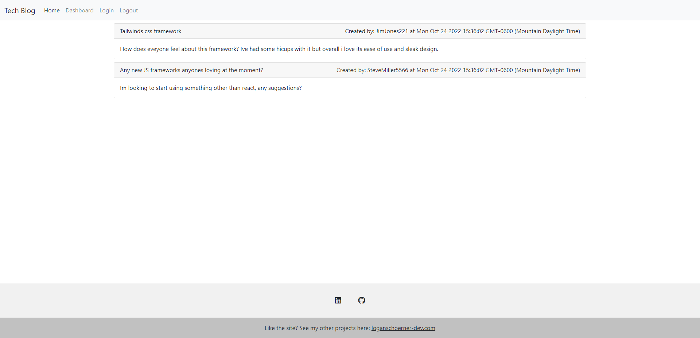

# BlogSite
 ## Description
  This is a simple tech blog website which displays our ability to create a SSR application.

  

 ## Table of Contents 
 - [Description](#description)
 - [Installation](#installation)
 - [Usage](#usage)
 - [Contributions](#contributions)
 - [Tests](#tests)
 - [License](#license)
 - [Questions](#questions)

 
 
  ## Installation
  N/A

  ## Usage
  This allows you to post about topics youre intrested in.

  ## Contributions
  Logan Schoerner

  ## Tests
  

  ## Licenses
    This project is covered under the MIT license. Click the license button at the top to learn more about what this means.

  ## Live App
  [Tech Blog](https://glacial-beach-76096.herokuapp.com)

  ## Questions
  Find me on GitHub at: [Logan2391](https://github.com/Logan2391) 
  Email me with questions regarding this application at: logan.schoerner@gmail.com

